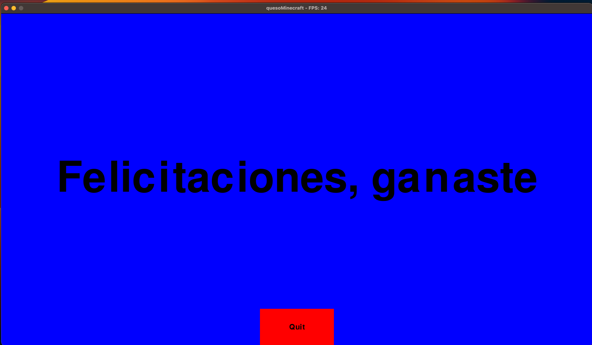

# CG_PR2
Proyecto #2 - Gráficas por Computadora

## Criterios de evaluación

- [ ] (0 a 50 puntos) [Criterio subjetivo] Por implementar el proyecto en algún hardware distinto a una computadora tradicional
   - **Razón:** no tengo raspi
- [ ] (Si agregan soporte para control, tienen 20)
   - **Razón:** no hay controles
- [x] (0 a 30 puntos) [Criterio subjetivo] Según la estética de su nivel
   - **Razón:** minecraft aesthetics 10/10
- [x] (15 puntos) por mantener alrededor de 15 fps (los fps se deben desplegar)
   - **Razón:** se mantiene como en 21-25 fps (se puede ver en el nombre de la ventana)
- [x] (20 puntos) Por implementar una cámara con movimiento hacia delante y hacia atrás y rotación
   - **Razón:** se puede mover el personaje con wasd y rotar con el mouse
- [x] (10 puntos más por implementar rotación con el mouse (solo horizontal))
   - **Razón:** si sirve
- [x] (10 puntos) Por implementar un minimapa que muestre la posición del jugador en el mundo. No puede estar lado a lado del mapa principal, debe estar en una esquina.
   - **Razón:** se puede ver en la esquina superior izquierda
- [x] (5 puntos) Por agregar música de fondo.
   - **Razón:** se puede escuchar la música de fondo
- [x] (10 puntos) Por agregar efectos de sonido
   - **Razón:** se puede escuchar el sonido de los pasos
- [x] (20 puntos) Por agregar al menos 1 animación a alguna sprite en la pantalla
   - **Razón:** se puede ver la animación del picaxe moviéndose al caminar
- [x] (5 puntos) Por agregar una pantalla de bienvenida
   - **Razón:** se puede ver la pantalla de bienvenida
- [x] (10 puntos más) si la pantalla permite seleccionar entre multiples niveles
   - **Razón:** se puede seleccionar entre 2 niveles
- [x] (10 puntos) Por agregar una pantalla de éxito cuando se cumpla una condición en el nivel
   - **Razón:** se puede ver la pantalla de éxito

**Total de puntos: 145 **

## Showcase

- [Video de Juego](https://youtu.be/my_lthTBW3s)
- 
- 
- 
- 
